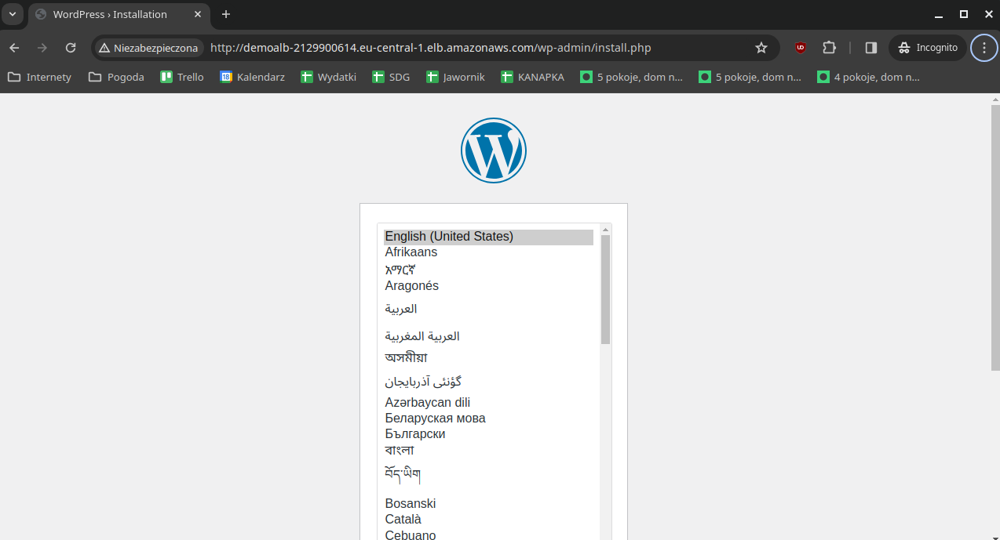

# Terraform demo - WordPress

## What is this?

This is a pure Terraform demo of WordPress installation on AWS. For demo purposes, the whole provisioning happens inside user-data script.

## What does this include?

This Terraform code provisions 
* new VPC
* two private subnets
* RDS MySQL instance for WordPress data
* EC2 instance for WordPress compute
* Application Load balancer to access the instance

## How to run it?

Run the usual `terraform apply` and visit the address printed at the end of the run. You should see the usual WordPress installation guide. After playing with it, run `terraform destroy` to clean up.

